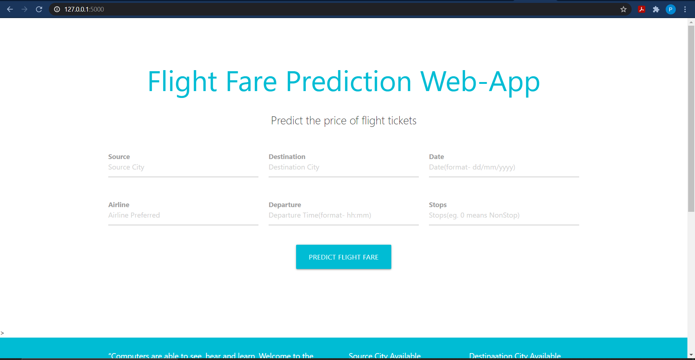
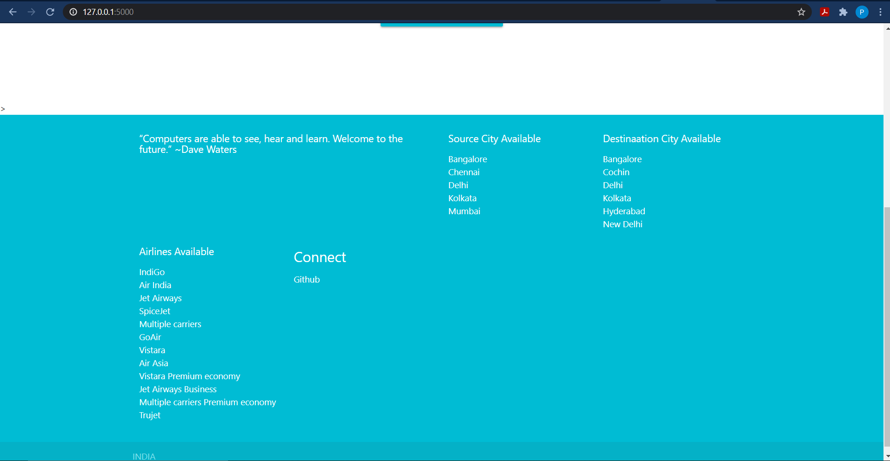
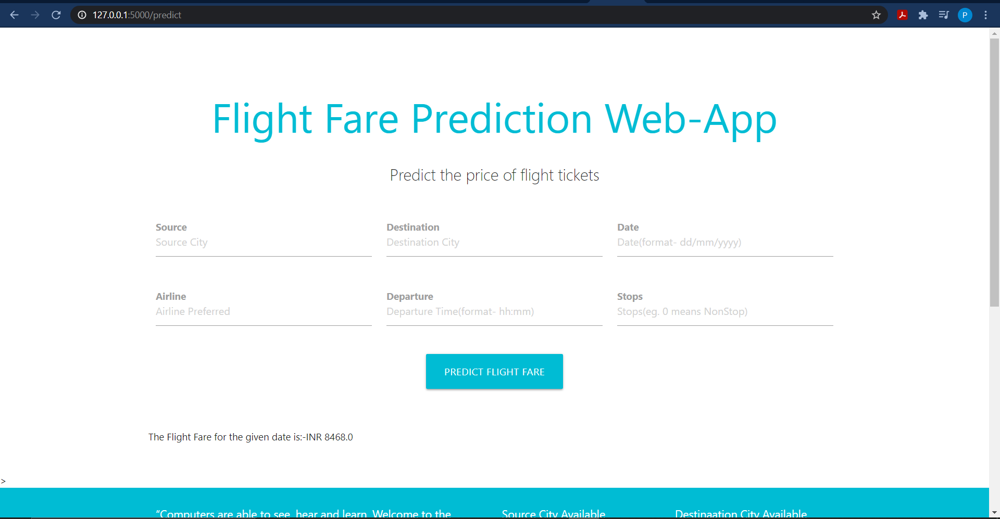

# Flight-Fare-Prediction-Web-App  
  
Link for the Web-App:-  https://mlflightfare-prediction.herokuapp.com/  
  
## ML-Model-Flask-Deployment
This is a project to elaborate how Machine Learn Models are made and deployed on production using Flask API

### Prerequisites
You must have Scikit Learn, Pandas (for Machine Leraning Model) and Flask (for API) installed.

### Project Structure
This project has four major parts :
1. model.py - This contains code fot our Machine Learning model to predict flight fare absed on trainign data in 'Data_Train.xlsx' file.
2. app.py - This contains Flask APIs that receives flight details through GUI or API calls, computes the precited value based on our model and returns it.
3. templates - This folder contains the HTML template to allow user to enter flight detail and displays the predicted flight fare.
4. static - This folder contains the .css file for the html file index.html to use and render a good looking web-app.

### Running the project
1. Ensure that you are in the project home directory. Create the machine learning model by running below command -
```
python model.py
```
This would create a serialized version of our model into a file model.pkl

2. Run app.py using below command to start Flask API
```
python app.py
```
By default, flask will run on port 5000.

3. Navigate to URL http://127.0.0.1:5000/ (This local server will be assigned after you run the unicorn command)

You should be able to view the homepage as below :  
  
  
   


Let me inform you that by clicking on the Source and Destination cities available ,you will land on the wiki page of that city and by clicking on the airline names(e.g Vistara) under the Airline Available tag these links will direct you to their respective official site  where you can further book tickets. The Github link under Connect tag brings you here:)  
  
Enter valid values in all 6 input boxes and hit Predict.

If everything goes well, you should  be able to see the predcited flight fare vaule on the HTML page like this:- 
  
  


